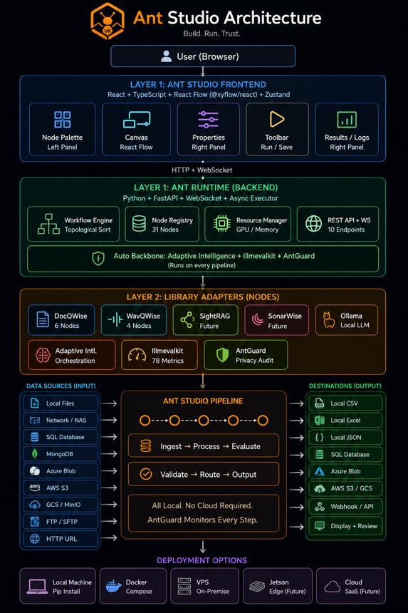

<div align="center">

<p align="center">
  
</p>

*Local-first visual AI pipeline builder: no cloud, no internet, your data stays on your machine.*

[](https://python.org)
[](LICENSE)
[](https://pypi.org/project/antstudio/)
[]()

[Features](#features) · [Quick Start](#quick-start) · [Templates](#templates) · [Architecture](#architecture) · [Ecosystem](#ant-intelligence-ecosystem)

</div>

---

## What is Ant Studio?

Ant Studio is an open-source visual AI pipeline builder. Drag nodes, connect them, click Run — build document extraction, time-series forecasting, and Q&A workflows without writing code.

Everything runs **locally on your machine**. No cloud APIs. No data upload. No internet required after installation.

### Key Principles

- **Privacy-First** — All processing stays on your hardware. AntGuard proves data never left.
- **Easy to Use** — Pre-built templates. Upload data → Run → See results in under 5 minutes.
- **Offline / VPS / On-Premise** — Docker deploys anywhere. Air-gapped environments supported.
- **API + Visual** — Node editor for non-technical users. REST API for developers.
- **Responsible AI** — llmevalkit quality scoring + AntGuard privacy audit on every pipeline.

## Features

### 24 Nodes across 5 categories

| Category | Nodes | Powered By |
|----------|-------|------------|
| **Document Intelligence** | PDF Loader, OCR, Field Extraction, Classification, Chunking, Q&A | DocQWise |
| **Temporal Intelligence** | Data Loader, Forecast (33 models), Anomaly Detection, Model Comparison | WavQWise |
| **Backbone** | Adaptive Router, Ollama LLM, Evaluate, Confidence Gate, Hallucination Check, AntGuard Start/Report | Adaptive Intelligence, llmevalkit, AntGuard |
| **Common** | File Input, Text Input | Built-in |
| **Output** | Display Result, Human Review, Export CSV/Excel/JSON | Built-in |

### 5 Ready-to-Use Templates

1. **Invoice Extraction** — PDF → Extract fields → Evaluate → Export CSV
2. **Sales Forecast** — CSV → Load → Forecast → Anomaly Detection → Export
3. **Sensor Anomaly Detection** — IoT data → Anomaly detection → Privacy audit
4. **Document Q&A** — PDF → Ask questions → Hallucination check → Display
5. **Basic Pipeline** — Simple extraction test

## Quick Start

### Option 1: pip

```bash
pip install antstudio
antstudio
# Browser opens at http://localhost:8000
```

### Option 2: From source (development)

```bash
git clone https://github.com/VK-Ant/ant-studio.git
cd ant-studio

# Backend
pip install -r requirements.txt
uvicorn backend.main:app --reload

# Frontend (new terminal)
cd frontend
npm install
npm run dev
# Open http://localhost:5173
```

### Option 3: Docker

```bash
docker compose up
# Open http://localhost:8000
```

## Usage

### Visual Pipeline Builder

1. Open Ant Studio in your browser
2. Click **Templates** → select "Invoice Extraction"
3. Configure the **File Input** node with your PDF path
4. Click **▶ Run**
5. Watch nodes execute in real-time (blue → green/red)
6. View results in the bottom panel with confidence scores

### CLI

```bash
python run_workflow.py templates/invoice_extraction.json
python run_workflow.py templates/sales_forecast.json
```

### API

```bash
# List available nodes
curl http://localhost:8000/api/nodes

# Run a workflow
curl -X POST http://localhost:8000/api/workflows/run \
  -H "Content-Type: application/json" \
  -d @templates/invoice_extraction.json
```

### Save & Reuse Workflows

Build a pipeline once → Save as JSON → Load anytime → Share with colleagues.
No code needed. The JSON file is your reusable workflow.

## Architecture

<p align="center">
  
</p>

The platform (Layer 1) never changes. Add new AI capabilities by writing node adapters (Layer 2). Create new solutions by saving workflow JSON files (Layer 3).

## Ant Intelligence Ecosystem

Ant Studio is the product layer of the **Ant Intelligence Ecosystem** — 7 open-source libraries:

| Library | Domain | Tagline |
|---------|--------|---------|
| [DocQWise](https://pypi.org/project/docqwise/) | Documents | Read. Extract. Retrieve. |
| [SightRAG](https://pypi.org/project/sightrag/) | Vision | See. Search. Retrieve. |
| [SonarWise](https://pypi.org/project/sonarwise/) | Audio | Hear. Search. Retrieve. |
| [WavQWise](https://pypi.org/project/wavqwise/) | Temporal | Sense. Forecast. Alert. |
| [Adaptive Intelligence](https://pypi.org/project/adaptive-intelligence/) | Orchestration | Learn. Remember. Adapt. |
| [llmevalkit](https://pypi.org/project/llmevalkit/) | Evaluation | Evaluate. Score. Improve. |
| [AntGuard](https://pypi.org/project/antguard/) | Privacy | Guard. Detect. Protect. |

## Testing

```bash
pip install pytest
PYTHONPATH=. python -m pytest tests/ -v
# 58 tests passing
```

See [TESTING.md](TESTING.md) for detailed testing guide.

## Roadmap

- [x] Core platform (node system, workflow engine, executor)
- [x] DocQWise nodes (document intelligence)
- [x] WavQWise nodes (temporal intelligence)
- [x] Backbone nodes (Adaptive Intelligence, llmevalkit, AntGuard)
- [x] 5 workflow templates
- [x] CLI runner
- [x] REST API + WebSocket
- [x] 58 tests
- [ ] SightRAG nodes (visual search)
- [ ] SonarWise nodes (audio)
- [ ] Human Review UI with field-level approve/reject
- [ ] Prompt-to-workflow generation
- [ ] Edge deployment (Jetson, Raspberry Pi)
- [ ] Ant Studio Cloud (managed hosting)

## Contributing

Ant Studio is open source under the Apache 2.0 license. Contributions welcome.

## License

[Apache License 2.0](LICENSE)

## Author

**Venkatkumar Rajan**
- GitHub: [github.com/VK-Ant](https://github.com/VK-Ant)
- Portfolio: [vk-ant.github.io/Venkatkumar](https://vk-ant.github.io/Venkatkumar/)
